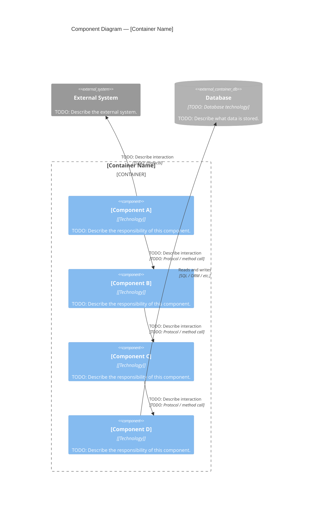

# C4 Component Diagram — Level 3

## Purpose

> The Component diagram zooms into a single **Container** (defined in the C4 Container diagram) and shows its internal building blocks — components, modules, or services — and how they communicate with each other.
> This diagram answers the question: "What is inside this container and how is it structured?"
> It is most valuable for complex containers where the internal structure is non-obvious or actively evolving.

> See also: [C4 Context Diagram](c4-context.md) | [C4 Container Diagram](c4-container.md)

---

## Diagram

> TODO: Replace the container name and component blocks below with the actual internals of the container you are describing.
> Repeat this diagram for each container that warrants internal documentation.
> Add or remove Component blocks as needed.
> Relationship labels should describe the direction and nature of the interaction.

---

## Notes

> TODO: Add any clarifications about the component boundaries, design decisions, or known limitations visible in this diagram.
> Example: "Component B acts as an anti-corruption layer. It translates external API responses into internal domain objects before handing them off to Component C."

