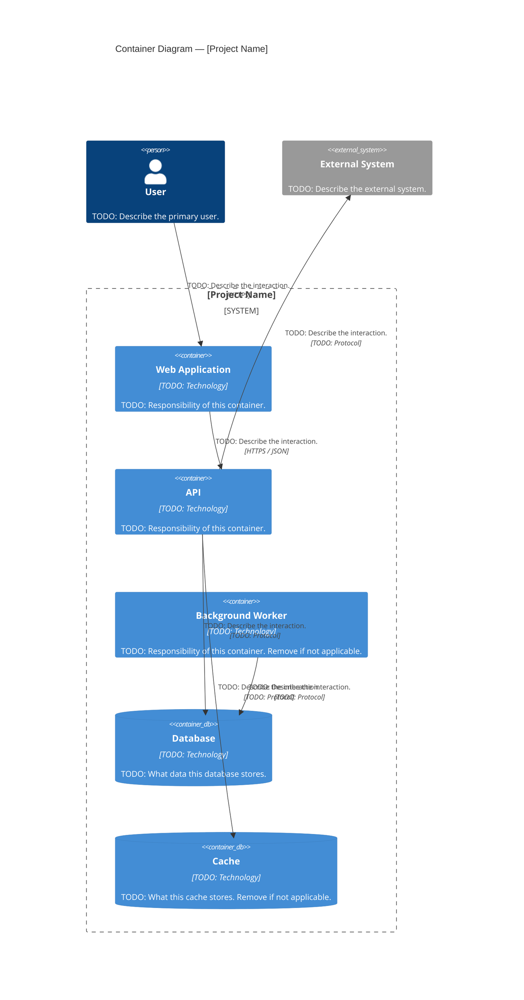

# C4 Container Diagram — Level 2

## Purpose

> The Container diagram zooms into the system boundary and shows the high-level technical building blocks — applications, services, databases, and other containers — and how they communicate with each other.
> A "container" in C4 terms is any separately deployable or runnable unit, not necessarily a Docker container.
> This diagram answers: "What are the main technical pieces of this system and how do they interact?"

---

## Diagram

> TODO: Replace the placeholders below with your system's actual containers.
> Common container types: Web App, Mobile App, API, Worker, Database, Cache, Message Broker, File Storage.
> Add or remove blocks as needed.

---

## Notes

> TODO: Add any clarifications about this diagram.
> Example: "The Background Worker is triggered by events from the database change stream. It does not expose any HTTP interface."

