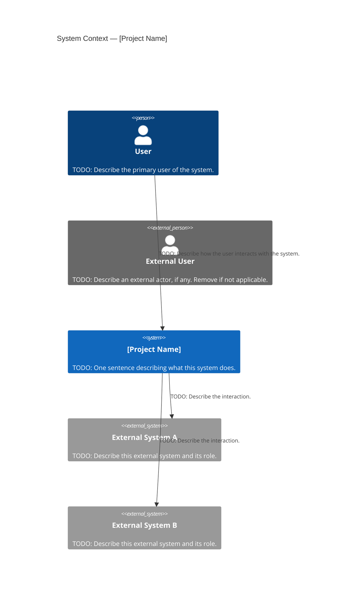

# C4 Context Diagram — Level 1

## Purpose

> The Context diagram shows the system as a single box in the center, surrounded by its users and the external systems it interacts with. It answers the question: "What is this system and who uses it?"
> This is the highest-level view and should be understandable by anyone, technical or not.

---

## Diagram

> TODO: Replace the placeholders below with your system's actual actors and external systems.
> Add or remove Person and System blocks as needed.
> Relationship labels should describe the nature of the interaction from the perspective of the arrow's direction.

---

## Notes

> TODO: Add any clarifications or observations about this diagram that are not self-evident from the visual alone.
> Example: "External System A is a third-party payment provider. The interaction is outbound only — this system initiates all requests."

