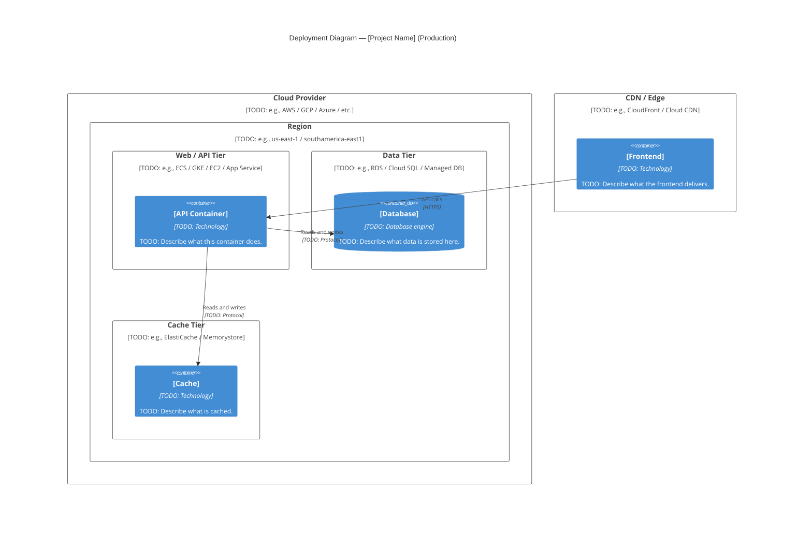

# Deployment Diagram

## Purpose

> The Deployment diagram shows how the system's containers are mapped to infrastructure — machines, cloud services, containers, and network zones.
> It answers the question: "Where does this system run and how are the parts connected in production?"
> This diagram is most useful when onboarding new team members, planning infrastructure changes, or troubleshooting production incidents.

> See also: [Architecture](../04-architecture.md) | [Deployment](../12-deployment.md) | [C4 Container Diagram](c4-container.md)

---

## Diagram

> TODO: Replace the placeholders with your actual infrastructure topology.
> Add or remove Node and Container blocks as needed.
> Common node types: cloud region, availability zone, server, Kubernetes cluster, managed service.

---

## Notes

> TODO: Add clarifications about the deployment topology.
> Example: "The database runs in a private subnet with no public access. The API communicates through a VPC endpoint."

