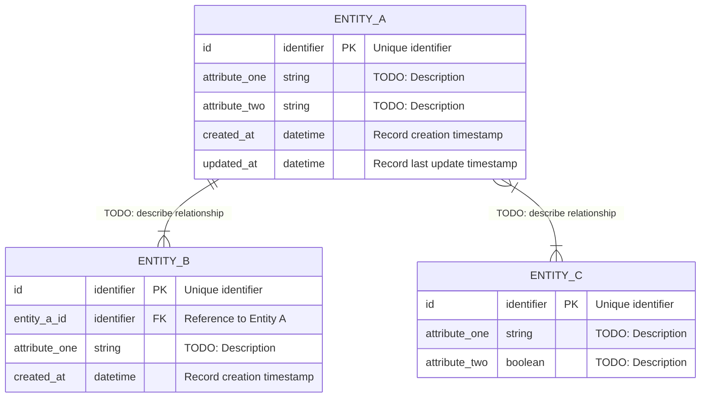

# Entity-Relationship Diagram

## Purpose

> The ER diagram shows the main entities in the data model and the relationships between them.
> It answers: "What data does this system store and how is it structured?"
> This diagram complements the data model document and should stay in sync with it.

> See also: [Data Model](../05-data-model.md)

---

## Diagram

> TODO: Replace the placeholders with your actual entities and attributes.
> Use the Mermaid erDiagram syntax.
> Relationship cardinality notation:
>   ||--|| : one and only one
>   ||--o| : one to zero or one
>   ||--|{ : one to one or many
>   ||--o{ : one to zero or many
>   }|--|{ : one or many to one or many

---

## Relationship Descriptions

> TODO: Describe each relationship in plain language to complement the diagram.

| Relationship | Description |
|-------------|-------------|
| ENTITY_A to ENTITY_B | TODO: Example: "One Entity A can have many Entity B records. Each Entity B belongs to exactly one Entity A." |
| ENTITY_A to ENTITY_C | TODO |

---

## Notes

> TODO: Add any clarifications about the data model that are not self-evident from the diagram.
> Example: "ENTITY_C uses a many-to-many relationship resolved through a join table not shown here for brevity. See the data model document for details."