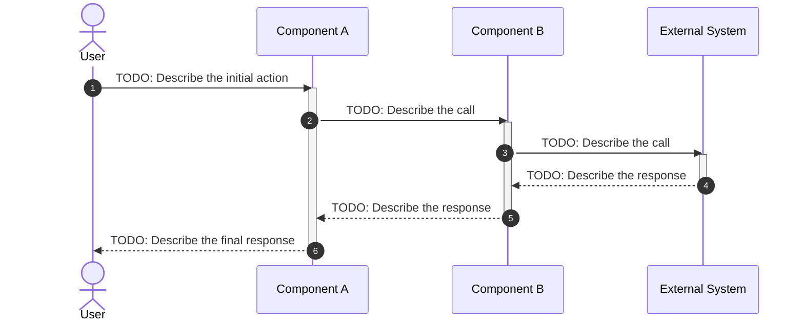

# Sequence Diagrams

## Purpose

> Sequence diagrams show how components interact over time to accomplish a specific operation.
> They are most useful for documenting critical or complex flows where the order of interactions matters.
> Each diagram in this file should focus on a single flow.

---

## How to Add a New Flow

> TODO: Copy the template block below, rename the section, and replace the placeholders.
> Keep each diagram focused on one scenario. Prefer multiple simple diagrams over one complex diagram.

---

## Flow: [Name of the Flow]

> TODO: Describe what this flow represents and when it occurs.
> Example: "This flow describes the steps executed when a user submits a new order, from the initial request to the confirmation response."

**Notes:**

> TODO: Add any clarifications about this flow.
> Example: "If the External System is unavailable, Component B retries up to 3 times before returning an error to Component A."

---

## Flow: [Name of Another Flow]

> TODO: Add additional flows following the same pattern above.
> Suggested flows to document: authentication, main business operation, error handling, background job execution.

