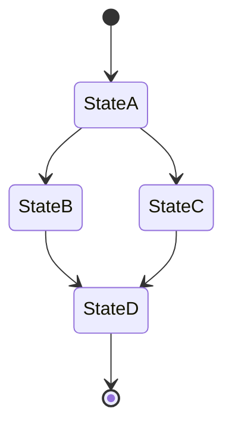

# State Diagrams

## Purpose

> State diagrams show the lifecycle of a domain entity — the states it can be in and the events or conditions that cause it to transition from one state to another.
> They are most useful for entities whose behavior changes significantly depending on their current state.
> Each diagram in this file should focus on a single entity.

---

## How to Add a New State Diagram

> TODO: Copy the template block below, rename the section, and replace the placeholders.

---

## [Entity Name] States

> TODO: Describe what this entity is and why its lifecycle is relevant to document.
> Example: "An Order progresses through several states from creation to fulfillment. Understanding these states is critical for processing logic and for determining which operations are allowed at each stage."

**State Descriptions:**

> TODO: Describe each state in plain language.

| State | Description | Allowed Operations |
|-------|-------------|-------------------|
| StateA | TODO | TODO |
| StateB | TODO | TODO |
| StateC | TODO | TODO |
| StateD | TODO | TODO |

**Transition Descriptions:**

> TODO: Describe each transition and the event or condition that triggers it.

| From | To | Event / Condition |
|------|----|-------------------|
| Start | StateA | TODO: Describe what creates the entity |
| StateA | StateB | TODO |
| StateA | StateC | TODO |
| StateB | StateD | TODO |
| StateC | StateD | TODO |
| StateD | End | TODO: Describe the terminal condition |

**Transition Rules:**

> TODO: Describe any business rules that govern state transitions.
> Example: "An Order can only be cancelled if it is in the Pending or Confirmed state. Once Shipped, it cannot be cancelled."

---

## [Another Entity Name] States

> TODO: Add additional state diagrams following the same pattern above.